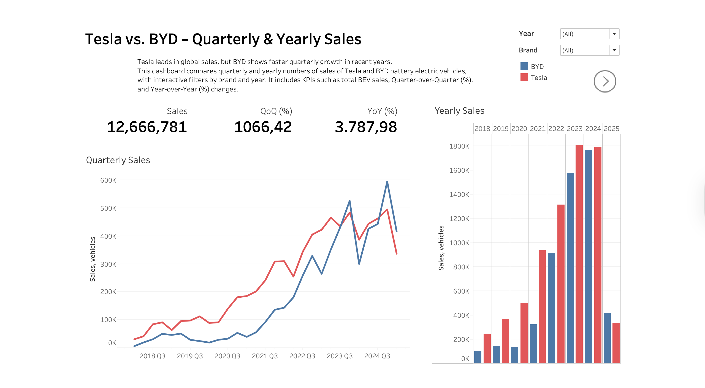

# EV Market Trends and Forecast: Tesla vs. BYD (2018–2025)

This project compares the battery electric vehicle (BEV) sales of **Tesla** and **BYD** from 2018 to Q1 2025 using Python-based data analysis, time series forecasting, and interactive dashboards. The goal is to examine sales trends for both brands during a period of rapid EV market expansion, and to explore whether financial indicators such as stock returns have any predictive value for future sales volumes.

---

## Project Structure

### 1. Exploratory Data Analysis (EDA)
- Cleaning and merging quarterly and yearly **sales** and **stock market** data
- Exploring global EV adoption patterns, brand performance, and powertrain transitions
- [Tesla_BYD_EDA.ipynb](Tesla_BYD_EDA.ipynb)

### 2. Predictive Modeling (Prophet)
- Forecasts based on:
  1. Baseline quarterly sales
  2. Model with tuned hyperparameters
  3. Model including an external regressor: lagged quarterly stock returns
- Evaluation using RMSE, MAE, MAPE, and R²
- [Tesla_BYD_ML.ipynb](Tesla_BYD_ML.ipynb)

### 3. Tableau Dashboards
- Interactive dashboards highlighting key trends and model insights  
- [View Dashboard on Tableau Public](https://public.tableau.com/views/Tesla_BYD_sales/Sales?:language=en-US&publish=yes&:sid=&:redirect=auth&:display_count=n&:origin=viz_share_link)

  
  
  

---

## Data Sources

**Sales Data**:
- Manufacturer reports via Wikipedia: [Tesla](https://en.wikipedia.org/wiki/History_of_Tesla,_Inc.), [BYD](https://en.wikipedia.org/wiki/BYD_Auto)  
- Q1 2025 BYD sales from [BYD Global Investor Notices](https://www.bydglobal.com/en/InvestorNotice.html) (aggregated from monthly announcements)

**EV Adoption**:
- [Global EV Outlook 2025](https://www.iea.org/reports/global-ev-outlook-2025), International Energy Agency (IEA)

**Stock Market Data**:
- `yfinance` API for daily stock prices of TSLA and BYDDY

*All data is public and used solely for educational, non-commercial purposes.*

---

## Tools & Technologies

- **Python**: Pandas, NumPy, Matplotlib, Seaborn, Scikit-learn, Prophet
- **Data Sources**: yfinance, IEA, public manufacturer reports
- **Visualization**: Tableau Public
- **Development**: Jupyter Notebooks

---

## Author

**Aleksej Talstou**  
Aspiring Data Scientist  
[LinkedIn](https://www.linkedin.com/in/aliaxey-talstou)

---
